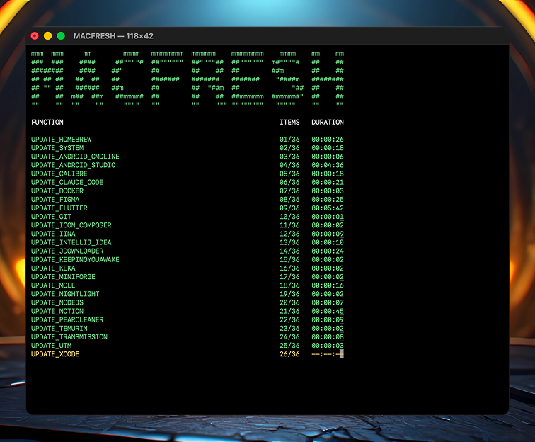

# MACFRESH

<p><picture></picture></p>

Configure your macOS machine automatically with this highly opinionated post-installation script. Update and install all necessary development tools and apply strict defaults without manual intervention.

## Launch Script

```shell
/bin/zsh -c "$(curl -fsL https://raw.githubusercontent.com/olankens/macfresh/HEAD/scripts/macfresh.sh)"
```

## Import Functions

```shell
source <(curl -fsL https://raw.githubusercontent.com/olankens/macfresh/HEAD/scripts/macfresh.sh)
```